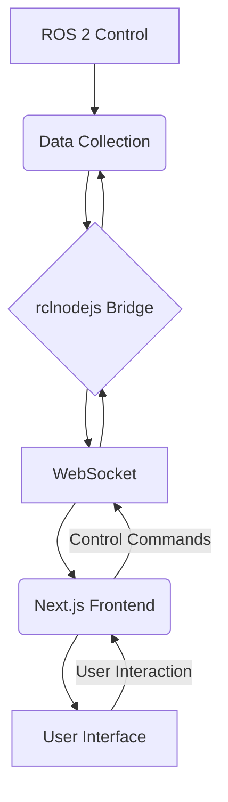

# ROS 2 Control Ecosystem Visualization

A visualization tool for ROS 2 control systems that displays the connections between controllers, broadcasters, and hardware interfaces as an interactive graph.

## Architecture



## 1. Introduction to ROS 2 and Graph Visualization

### What is ROS 2?
ROS 2 (Robot Operating System 2) is an open-source framework for building robot applications. It provides libraries and tools to help developers create robust, general-purpose robot software.

### What is a Directed Acyclic Graph (DAG)?
A DAG is a graph with directed edges and no cycles. In the context of ROS 2, DAGs can represent:
- Node communication patterns
- Control flow in a robotic system
- Hardware and software component relationships

### What I've Built
This project creates:
1. A custom ROS 2 message type to represent graph connections
2. A ROS 2 node that publishes these connections
3. A web application that visualizes the graph in real-time
4. Interactive features to explore and understand the graph

## Overview

This project provides a web-based visualization tool for ROS 2 control systems. It displays the connections between controller managers, controllers, broadcasters, and hardware interfaces as an interactive graph, making it easier to understand the relationships and data flow within a ROS 2 control system.

Key features:
- Interactive graph visualization of ROS 2 control components
- Real-time updates as connections change
- Support for both command and state interfaces
- Visual distinction between hardware and software components
- Connection metadata display
- Manual connection creation for testing and development

## Repository Structure

```
ROS-2-Control-Ecosystem-Visualization/
├── ros_packages/               # ROS 2 packages
│   ├── graph_interfaces/       # Custom message and service definitions
│   ├── graph_publisher/        # Sample publisher node for testing
│   ├── topic_service_client/   # Topic subscriber and service client
│   └── service_provider/       # Service provider for testing
└── frontend/                   # Next.js web application
```

## Prerequisites

- ROS 2 (Humble or later)
- Node.js (v16 or later)
- npm or yarn

## Installation

### 1. Clone the repository

```bash
git clone git@github.com:ayuugoyal/ROS-2-Control-Ecosystem-Visualization.git
cd ROS-2-Control-Ecosystem-Visualization
```

### 2. Build the ROS 2 packages

```bash
# Source ROS 2
source /opt/ros/humble/setup.bash  # Replace 'humble' with your ROS 2 distribution

# Create a ROS 2 workspace
mkdir -p ~/ros2_graph_ws/src
cp -r ros_packages/* ~/ros2_graph_ws/src/

# Build the workspace
cd ~/ros2_graph_ws
colcon build --symlink-install

# Source the workspace
source install/setup.bash
```

### 3. Set up the Next.js application

```bash
# Navigate to the frontend directory
cd ROS-2-Control-Ecosystem-Visualization/frontend

# Install dependencies
npm install
```

## Usage

### 1. Start the ROS 2 publisher node (for testing)

In a terminal:

```bash
# Source ROS 2 and your workspace
source /opt/ros/humble/setup.bash
source ~/ros2_graph_ws/install/setup.bash

# Run the graph publisher node
python3 ~/ros2_graph_ws/src/graph_publisher/graph_publisher.py
```

### 2. Start the Next.js application

In another terminal:

```bash
# Navigate to the frontend directory
cd ~/ROS-2-Control-Ecosystem-Visualization/frontend

# Start the development server
npm run dev
```

### 3. Access the application

Open your browser and navigate to:

```
http://localhost:3000
```

### 4. Using the application

1. Click "Connect to ROS 2" to establish a connection
2. Click "Call Service" to get the initial graph data
3. Watch as new connections are published every 5 seconds (if you're running the test publisher)
4. Try adding manual connections using the form

### 5. Testing the topic subscriber and service client

In separate terminals:

```bash
# Terminal 1: Start the service provider
source ~/ros2_graph_ws/install/setup.bash
ros2 run service_provider service_provider

# Terminal 2: Start the topic subscriber and service client
source ~/ros2_graph_ws/install/setup.bash
ros2 run topic_service_client topic_service_client

# Terminal 3: Publish a test message
source ~/ros2_graph_ws/install/setup.bash
ros2 topic pub --once /input_topic std_msgs/msg/String "data: '10 20'"
```

## Testing with Command Line

You can also publish custom messages from the command line for testing:

```bash
# Source ROS 2 and your workspace
source /opt/ros/humble/setup.bash
source ~/ros2_graph_ws/install/setup.bash

# Publish a custom message
ros2 topic pub --once /graph_connections graph_interfaces/msg/GraphConnection "{start: 'command_line', end: 'hardware_interface', command_interface: true, state_interface: false, is_hardware: true, metadata: 'Published from command line'}"
```

## Custom Message and Service Definitions

### GraphConnection.msg
```
string start
string end
bool command_interface
bool state_interface
bool is_hardware
string metadata
```

### GetGraph.srv
```
# Request (empty)
---
# Response
graph_interfaces/GraphConnection[] connections
```

## Troubleshooting

If you encounter issues with rclnodejs:

```bash
cd ~/ROS-2-Control-Ecosystem-Visualization/frontend
npm rebuild rclnodejs
```
